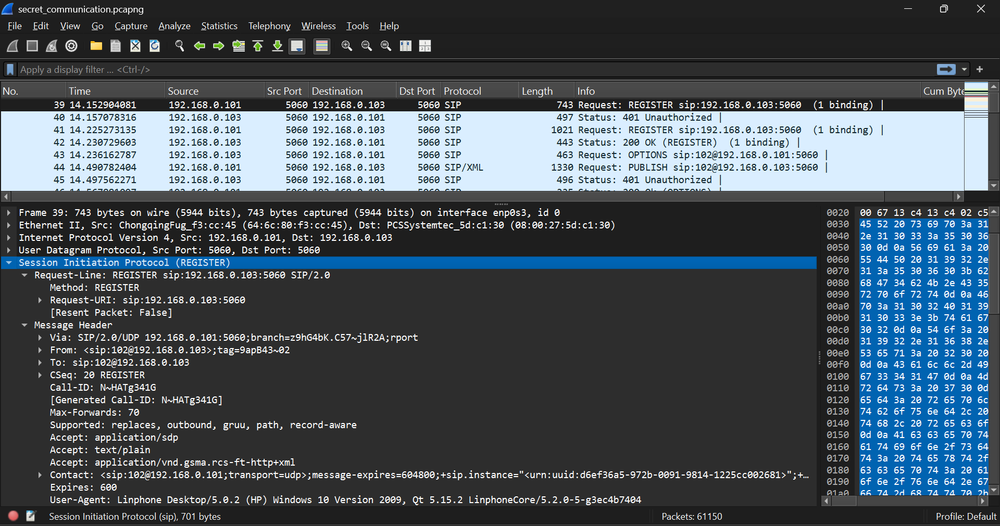
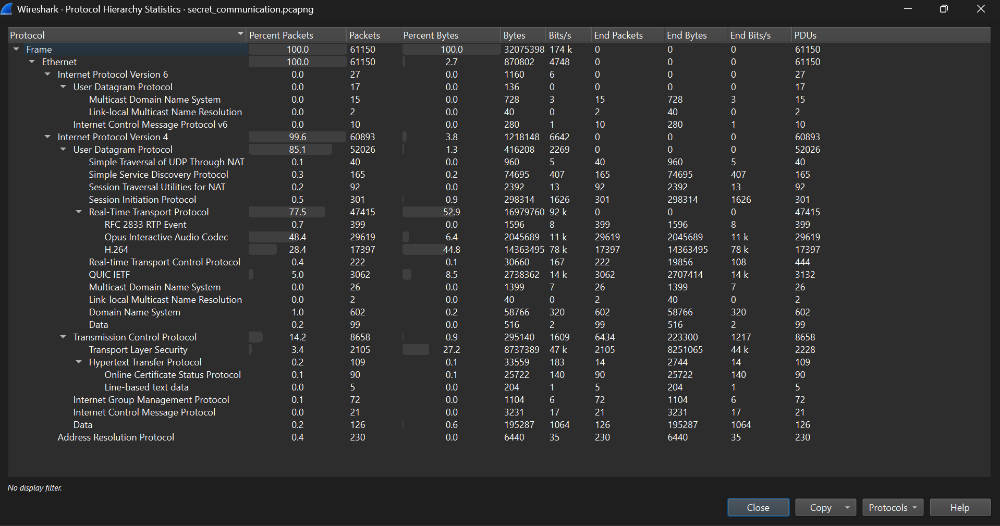
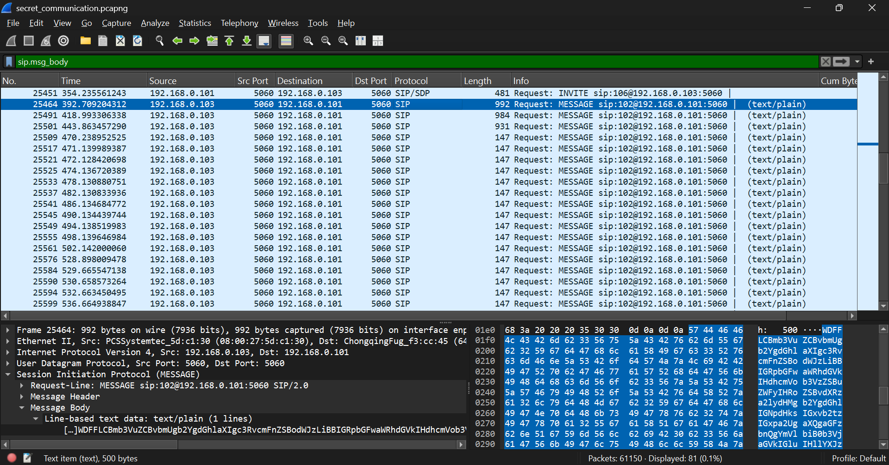
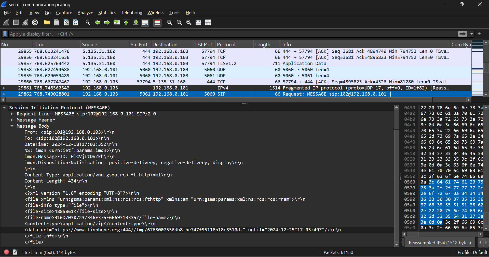
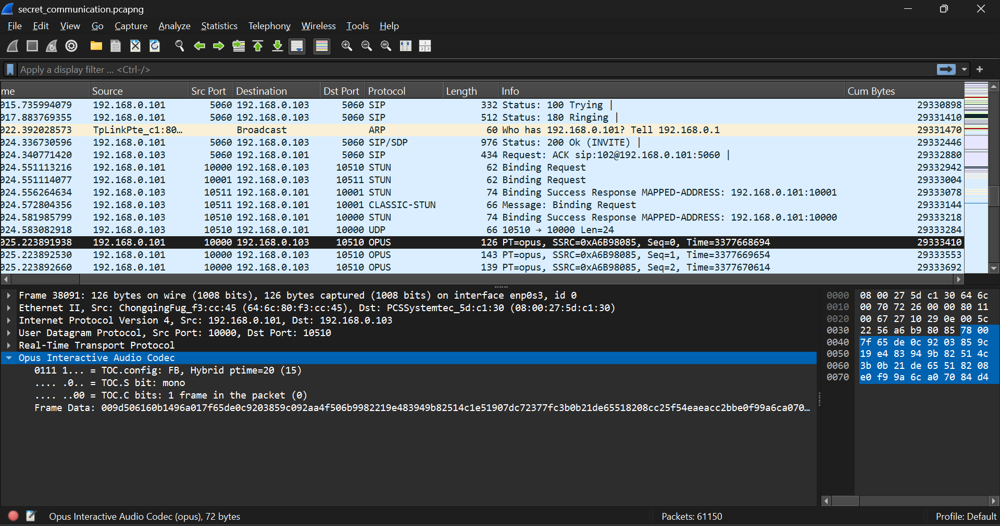
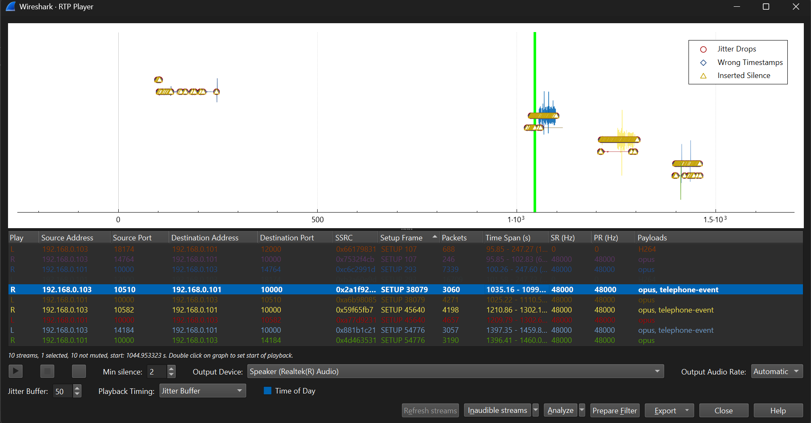
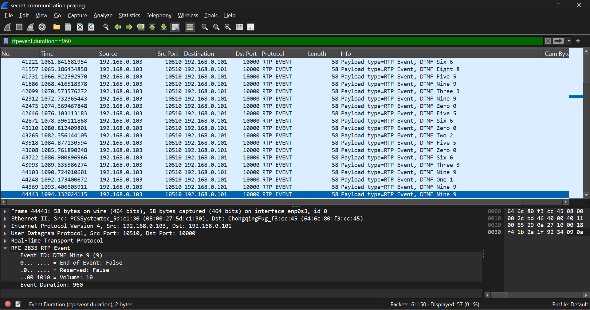

# Forensics/American Spy

## Challenge Description

In the shadows of global espionage, Agent Dr4k3n and Agent X1E of the FIA Secret Agency worked together to uncover a critical intelligence operation. Embedded in the Middle East, Dr4k3n relied on X1E for analysis and support. Tragically, X1E was found dead under mysterious circumstances, leaving behind a message:- `I'm good, hope you're doing well too. Don't forget to do VC`. As a Digital Forensics Examiner, your mission is to decode their communications, uncover the secrets they were chasing, and help the agency. Wrap the flag in the following format: flag{}

Note: The flag is in 4 parts
Hints: The base64 encoded images are not relevant to the solution of the challenge.
       The flag is a sentence that makes sense grammatically, split up into 4 parts, you'll know it when you see it.
Source file: secret_communication.zip

## Message from the Author

This challenge holds a special place in my heart as it’s the first one I’ve ever created. I designed it within 20 days, marking my debut as a challenge author. This challenge need your patience and presence of mind to collect all the data and make a link between them. There might have been chances of misinterpretation, which is why I stayed active and assisted the users. However, many of them remained stuck with H.264, Opus, and some messages.

The concept for the challenge was straightforward—it involved basic processes to uncover parts of the flag, which I carefully pieced together into a single cohesive task. I honestly believed it would be solved in no more than 1-2 hours. To my surprise, it turned out to be tougher than expected, taking 22 hours out of 24 for even the top global CTF teams to crack it!!!

In the end, it was successfully solved by `RJCyber`. That moment was exhilarating and humbling at the same time.

Now, I’m here to share my journey with you all—my thoughts as the author and insights from the solver’s perspective. I’d love to hear your feedback and connect with you. This is also my very first writeup on my GitHub, and I couldn’t be more excited to share it with the world. 

Let’s dive into the solution together!

## Solution

Let's read the description clearly, because, you know, every minor thing matters in life, right?
After reading the description, I gathered that Agent Dr4k3n went to the Middle East for some secret operations, while Agent X1E was in America assisting Dr4k3n. Unfortunately, someone killed X1E, leaving a message for Dr4k3n. This message hints at something related to "VC," which could mean Voice Call or Video Call.

So here we are, as Digital Forensics Examiners! Woah, let's go finally! We need to decode their communications, and I sense so much suspense already.

Upon unzipping the file, we get a pcapng file:
```bash
$ file secret_communication.pcapng
secret_communication.pcapng: pcapng capture file - version 1.0
```

Let's open it in [Wireshark](https://www.wireshark.org) (a free and open-source packet analyzer.)

When I saw *61,150* colored packets, I must admit—it was intimidating. But don't worry, we’ll find the flag. Let’s dig deeper!

Initially, I noticed some normal packets. After scrolling down, I encountered SIP protocol packets, something I wasn't very familiar with. Here's one of the packets:

```yaml
39	14.152904081	192.168.0.101	5060	192.168.0.103	5060	SIP	743	Request: REGISTER sip:192.168.0.103:5060  (1 binding) | 25848
```



Interestingly, this packet had:

```makefile
sip.User-Agent: Linphone Desktop/5.0.2 (HP) Windows 10
```

The Username in the SIP protocol was 102, linked to "HP."

Upon further searching, I found another SIP UA:

```makefile 
sip.User-Agent: Dr4k3n
```

linked to Username 101 in Packet No. 25585. From this, I assumed "HP" was X1E.

Then i started checking the Protocol Hierarchy Statistics(Wireshark -> Statistics -> Protocol Hierarchy)



The main packet volumes were under:

IPv4 -> UDP -> SIP, RTP, RTCP
RTP included H.264, Opus, RFC 2833 RTP Event
Here’s what I learned:

```
UDP (User Datagram Protocol): UDP is a transport-layer protocol used to send small packets of data with low latency.
SIP (Session Initiation Protocol): SIP is an application-layer signaling protocol used to establish, modify, and terminate multimedia sessions (e.g., VoIP calls).
RTP (Real-Time Transport Protocol): RTP is used for transmitting audio and video data in real-time over IP networks.
RTCP (Real-Time Control Protocol): RTCP works alongside RTP to provide control and monitoring of data delivery.
H.264 (Video Codec): H.264 is a video compression standard used to encode video streams efficiently, often used in video calls.
Opus (Audio Codec): Opus is a highly versatile and efficient audio codec optimized for real-time communication like VoIP.
RFC 2833 RTP Events: Defines how telephone signaling events (e.g., DTMF tones, fax tones) are transmitted over RTP.
TCP (Transmission Control Protocol): Establishes a reliable connection between endpoints using a three-way handshake (SYN, SYN-ACK, ACK).
```

So the theme of the challenge became clearer: communications over Internet Protocols, hinting at calls and possibly messages. Let's move ahead.

In Packet 79:
```yaml
79	62.206017740	192.168.0.103	5060	192.168.0.101	5060	SIP	520	Request: MESSAGE sip:102@192.168.0.101:5060 |  (text/plain) 35762  
```
The message was: "We will talk further on VoIP". This confirmed both calls and text messages.

Later, Packet 109:

```yaml
109	83.548479120	192.168.0.103	5060	192.168.0.101	5060	SIP	515	Status: 180 Ringing | 53116 
```


indicated that X1E called Dr4k3n. RTP packets with H.264 & Opus codecs confirmed this. I started searching for the tools which will help me to extract the video and audio from the packets.
Got this [h264extractor](https://github.com/volvet/h264extractor) plugin, I extracted a video file (Video_call.264). After converting it to .mp4, here's the result:

<video width="800" height="320" controls> <source src="./assets/Video_call.mp4" type="video/mp4"></video>

This is the clear video by the CTF Participant `d33znu75 (Discord)` Another guy after RJCyber who was leading, Respect Man.

The video revealed a message:
```less
We all believe in you. This mission is bigger than any one of us, and it will span 4 years. By then, the value will reach *150/s —remember that 0y4qt. 
```

X1E spoke about the mission, duration, and sus values were also there *150/s and 0y4qt, which might not be plaintext. Let's keep these data with us.

Scrolling further, i got another SIP Message Packet:
```yaml
25427	319.831729321	192.168.0.103	5060	192.168.0.101	5060	SIP	560	Request: MESSAGE sip:102@192.168.0.101:5060 |  (text/plain)	16531002
```
The message was `Hey X1E, I hope you're doing well. I'll be sending some data shortly.` from dr4k3n.

Author's Note: The `data` can includes text messages, voice calls, video calls, emails, documents, images, audio files, and any other digital information exchanged.

Now as we get to know Dr4k3n is going to share some data from Middle East to X1E related to that place. We can apply the filter as shown in the image below to just focus on the sent data and save our time.



I found base64-encoded messages sent by Dr4k3n:

```
X1E, found one of their storage hubs. A dilapidated warehouse near the outskirts of the city, looks like it hasnt been touched in years. But inside? Its a different story. Crates labeled as 'textiles' are packed with explosives. The guards are armed but discreetdressed like workers. They're moving something big tonight. Ill plant a tracker and slip out before they notice

Spotted a remote camp in the middle of the desert. Looks like a training groundabout a dozen men running drills with advanced weaponry. Theyre disciplined. Theres a man leading them who doesnt fit the profilepossibly ex-military. Got close enough to snap a few pictures but couldnt risk staying longer. The heat is making surveillance tricky. Sending coordinates now.

Got a lead on a meeting spotan underground club that operates after midnight. Musics deafening, and the crowd makes it easy to blend in. Their VIP section is where the deals go down. Managed to overhear fragments of a conversation about a high-profile target. Ill try to lift fingerprints off one of their glasses when I head out.
```

Afterwards, Dr4k3n sent 3 base64-encoded images, which were never fully transmitted. All the images were incomplete.

Author's Note: All of this was done to create a realistic scenario where Dr4k3n was sending text messages related to the hideouts. The images were intentionally not sent completely over the network. SIP has limitations with file transfer features, and I have limited knowledge as of now. This was the rabbit hole, so I was assisting whoever reached these steps. Later on, I released hints for these to save your time.

Following up on the SIP Message Body Packets, I found 3 SIP Message packets (no. 25855, 25886, 29862) which were very different from any other packets. While checking the message body section, all 3 had XML tags, with 2 of the packets having ```Content-Type: application/im-iscomposing+xml\r\n``` and another having ```Content-Type: application/vnd.gsma.rcs-ft-http+xml\r\n```. There was a huge volume of TCP Protocols ranging from packet 25855 to 29862, which suggests something was shared between Dr4k3n and X1E, but it was encrypted due to TCP/TLS, as you can see in the 29862 Packet Message Body shown below.



It contained metadata related to some files, and I noticed the content type was zip and the filename was in hex(1mp0r74n7_fi135). Also, a suspicious data URL was present, which I tried to visit, and boom—it was the file's URL that was present on the server with a valid duration.

Author's Note: I would say this was the main part of the challenge. I discovered this while experimenting with SIP accounts after many unsuccessful attempts at sending files through the Asterisk Server SIPs. Then I tried Linphone's Direct Method of file transferring. Many players were unable to find this file. I thought that by looking at these many TCP packets along with suspicious SIP Message Packets—which looked different from the text/plain SIP Messages, after the incomplete images—players would find this. Very few players managed to get this link.

 Downloading and unzipping it gave 2 files:

```bash
~/Downloads
$ unzip 6763007556db8_be747f95118b18c3510d_.zip
Archive:  6763007556db8_be747f95118b18c3510d_.zip
   creating: 316D70307237346E375F6669313335/
  inflating: 316D70307237346E375F6669313335/62795F6472346B336E.wav
  inflating: 316D70307237346E375F6669313335/74305F583145.txt

~/Downloads/316D70307237346E375F6669313335
$ file *
62795F6472346B336E.wav: RIFF (little-endian) data, WAVE audio, IEEE Float, mono 22050 Hz
74305F583145.txt:       ASCII text, with CRLF line terminators
```

These filenames were also different, so when I decoded them, I found they were also in hex (by_dr4k3n.wav, t0_X1E.txt). This gave me clarification that these files were relevant to the challenge.

The .txt file contained:

```
eXXXXXXXXXXXXXXXXXXXXXXXXXXXXXX7
128 Avenue, East Street, Elm Court, Boulevard.

```

Author's Note: The Cipher Text is hidden due to some reasons.

It seemed like this was also encoded by Dr4k3n. I tried hex -> ASCII conversion, but it wasn't hex. Later, when I read the address and tried to search it online, I found no results. I thought it was just a custom address, but when I read the initial characters of the words, I discovered "128 A E S E C B". Wow! So this was the encryption scheme, but to decrypt it, I needed the key, so I continued searching.

I started exploring and applied all the steganography tools on the WAV file, but got no results, so I moved on.

After scrolling further down, there were some protocols that seemed unrelated to the challenge—it looked like someone was browsing on Mozilla Firefox.
From Packet No. 38091 onwards, only Opus Protocols were visible, which hinted at an audio call.


You could either extract it through the Opus Extractor Plugin or listen to it directly through the RTP Player of Wireshark (Telephony -> RTP -> RTP Streams -> Play Streams).



The same audio was repeated twice, and this was the message in the audio from Dr4k3n:

```
I hope you're doing well. I'm managing fine here. Please pass my regards to my family and friends. Now listen carefully. I’ve uncovered all the secret locations and identified their head. I trust you’ve received all the data I’ve sent so far. Forward it to the heads of the Agency immediately. And one more thing if anything happens to me, tell my small kid in case that the key to his box is i will come home
```

An interesting aspect was the choice of words like [small, case, key, box], and the key was "i will come home". I think "small case" referred to the key, and "box" might have been used for the AES encryption, so I quickly tried decrypting the cipher text we found earlier, and hurray—I got Part 4 of the flag.

When I listened to the second repeated audio carefully, there were some beep sounds from the dial pad, which were the same in the third opus-telephone event. When I checked the packets, I realized there were some RFC 2833 RTP Events Packets too, which were mentioned in Protocol Hierarchy Statistics under RTP Streams. These were used to carry information about telephony events like DTMF digits, which we could see in the packet sequence.



The DTMF digits were 6859390560250639199. After seeing this long integer, I tried to convert it using long_to_bytes:

```python
from Crypto.Util import number

# Convert a long integer to bytes
long_int = 6859390560250639199
byte_representation = number.long_to_bytes(long_int)
print(f"Long integer to bytes: {byte_representation}")
```
The Output was:
Long integer to bytes: b'\_1s_7h3\_'

Wow, I got the second part of the flag too! Most of the packets were analyzed, but we had only found 2 parts of the flag, with 2 still remaining.

I started exploring all the available data and noticed that I hadn't yet used the WAV file that came with the TXT file. When I reviewed the video message again, the mention of "4 years" sounded like "Fouriers," and there was also a mention of "*150/s" which could be interpreted as * 150 Hz. Additionally, the metadata showed IEEE Float, mono 22050 Hz. Since the sample rate usually remains constant in a WAV file, I decided to explore the data further. I performed an FFT on it and started exploring the frequency domain of the WAV file. I found decimals at multiples of 150 in the magnitudes, suggesting that Dr4k3n had hidden the message in multiples of 150, where 150 represented the index in FFT, corresponding to a frequency component in the signal.

Python script to decode it:

```python
import numpy as np
from scipy.io import wavfile

# Step 1: Read the WAV file
sample_rate, data = wavfile.read('62795F6472346B336E.wav')

# Step 2: Apply Fourier Transform
fft_result = np.fft.fft(data)
mags = np.abs(fft_result)

flag = ''
for i in range(len(mags)):
    if i%150==0:
        print(mags[i])
        if 32  < round(mags[i]) < 126: # To print ASCII Value
            flag+=chr(round(mags[i]))
print(flag)
```

Hooray! We got the third part of the flag, which was "f0un63r_0f_". So we had 3 parts, with only 1 part left. We got the Part 1 of the flag which was hidden somewhere, and with this, we got all the parts of the flag. Now let's combine them to form the complete flag.

<span style="color: white; background: black">The flag is: flag{PART1_1s_7h3_f0un63r_0f_PART4}
</span>

Author's Note: The parts of the flag are hidden due to some reasons.

Final Message: I've tried my best to give the realistic environment through the chal. This challenge was a bit based on guesswork, and I acknowledge this, but many players were unable to find the file's URL, which disappointed me. As for the FFT and Part 1 of the flag, I was assisting the players so they would get the hints/messages that were present and could proceed with the challenge. Respect to all the players who attempted my challenge. RJCyber was the only person who was able to solve this challenge because he found the file's URL and, after getting some clarifications, he achieved first blood on the challenge. I'll be happy to receive your suggestions regarding the challenge.